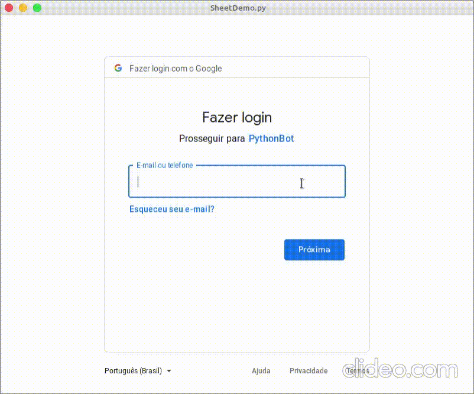

# PythonWebKitGoogle - Embed in your Application Google Docs Pages

# To Run
The demo is configured to run with python 3.8, but should work in any version
Follow the instructions in [webextension](https://github.com/aperezdc/webkit2gtk-python-webextension-example) repository to install the dependencies

    ./SheetDemo.sh http://docs.google.com/spreadsheets/d/<spreadsheetNumber>

